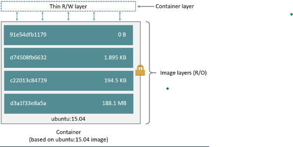

# Docker Mastery Course

[Link to the course](https://www.udemy.com/course/docker-mastery/)

## Content

* [Creating and Using Docker Containers](#docker-containers)
  * [Docker Networks](#docker-networks)
    * [Concepts](#docker-networks-concepts)
    * [Defaults](#docker-networks-defaults)
    * [CLI Management](#docker-networks-cli-management)
      * [Default Security](#docker-networks-default-security)
    * [Domain Name System](#docker-networks-dns)
    * [Assignment](#docker-networks-assignments)
* [Container Images - where to find them and how to build them](#container-images)
  * [Docker Hub](#docker-hub)
  * [Images and their Layers](#images-and-their-layers)
  * [Image Tagging and Pushing to Docker Hub](#image-tagging-and-pushing-to-docker-hub)
  * [Building Dockerfile](#building-dockerfile)
* [Clean Yo System](#clean-yo-system)
* [Container Lifetime & Persistent Data](#container-lifetime-&-persistent-data)
  * [Persistent Data: Data Volumes](#persistent-data-data-volumes)
  * [Printing working directory on different OS](#printing-working-directory-on-different-os)
  * [Persistent Data: Bind Mounting](#persistent-data-bind-mounting)
  * [Persistent Data: Wrap up](#persistent-data-wrap-up)
  * [Assignment: Database Upgrades with Named Volumes](#assignment-database-upgrades-with-named-volumes)
  * [Assignment: Edit Code Running In Containers With Bind Mounts](#assignment-edit-code-running-in-containers-with-bind-mounts)
* [Docker Compose](#docker-compose)
  * [docker-compose.yml](#docker-compose.yml)
* [Swarm](#swarm)
  * [Swarm Mode](#swarm-mode)
  * [Swarm Usage](#swarm-usage)
  * [Notable Features in the CLI](#notable-features-in-the-cli)
  * [Creating a 3-node Swarm](#creating-a-3-node-swarm)
  * [Quiz on Swarm Mode Basics](#quiz-on-swarm-mode-basics)

## Docker Containers

Section 3 of the mastery course.

## Docker Networks

### Docker Networks Concepts

* Review of *docker container run -p*
* For local dev/testing, networks usually "just work"
* Quick port check with *docker container port* *\<container\>*
* Learn concepts of Docker Networking
* Understand how network packets move around Docker

### Docker Networks Defaults

* Each container connected to a private virtual network "bridge"
* Each virtual network routes through NAT firewall on host IP
* All containers on a virtual network can talk to each other with -p
* Best practice is to create a new virtual network for each app:
  * network "my_web_app" for mysql and php/apache containers
  * network "my_api" for mongo and nodejs containers
* "Batteries Included, But Removable"
  * Defaults work well in many cases, but easy to swap out parts to customize it.
* Make new virtual networks.
* Attach containers to more then one virtual network (or none)
* Skip virtual networks and use host IP (--net=host)
* Use different Docker network drivers to gain new abilities
* and much more...

```bash
docker container run -p 80:80 --name webhost -d nginx
```

-p (--publish)\
Remember publishing ports is always in **HOST:CONTAINER** format

```bash
docker container port webhost
```

List port mappings or a specific mapping for the container. \
Meaning which port forwards traffic to that container from host to the container itself.

```bash
docker container inspect --format '{{ .NetworkSettings.IPAddress }}' webhost
```

You can compare with your own ip address by typing:

```bash
ipconfig
```

Your routers IP-address is the *Default Gateway* value, whereas your computers IP-address is the *IPv4 Address* value.


### Docker Networks CLI Management

* Show networks *docker network ls*
* Inspect a network *docker network inspect*
* Create a network *docker network create --driver*
* Attach a network to container *docker network connect*
* Detach a network from container *docker network disconnect*

--network bridge\
Default Docker virtual network which is NAT'ed behind the HOST IP\
--network host\
It gains performance by skipping virtual networks but sacrifices security of container model.\
--network none\
removes eth0 and only leaves you with localhost interface in container.\
\
We can also create our own docker network by using *docker network create*, which Spawns a new virtual network for you to attach containers to.

```bash
docker network create my_app_net
```

Creates a network called my_app_net. When we *docker network ls* now we identify the newly spawned virtual network with the network driver **bridge**.\
*network driver = Built-in or 3rd party extensions that give you virtual network features.*\
We may specify what network a certain container should run on by for example:

```bash
docker container run -d --name new_nginx --network my_app_net nginx
```

*docker network connect = Dynamically creates a NIC in a container on an existing virtual network*\
*NIC = [Network Interface Controller](https://en.wikipedia.org/wiki/Network_interface_controller)*

#### Docker Networks Default Security

* Create your apps so frontend/backend sit on same Docker network
* Their inter-communication never leaves host
* All externally exposed ports closed by default
* You must manually expose via -p, which is better default security!
* This gets even better later with [Swarm](#swarm) and [Overlay](#overlay) networks.

### Docker Networks DNS

How different containers find each other. It's generally a bad idea to rely on IP's because they may change if you restart containers in different orders. Thus it's very handly to able to reference containers by their container name rather than their IP's.\
*DNS = [Domain Name System](https://en.wikipedia.org/wiki/Domain_Name_System)*

* Understand how DNS is the key to easy inter-container comms
* See how it works by default with custom networks
* Learn how to use --link to enable DNS on defauly bridge network

**Forget IP's**: *Static IP's and using IP's for talking to containers is an anti-pattern. Do your best to avoid it.*

Built in solution to handle it:\
*Docker DNS = Docker daemon has a built-in DNS server that containers use by defauly.*

### Docker Networks Assignements

#### Docker Networks CLI App Testing

* Use different Lunix distro containers to check *curl* cli tool version
* Use two different terminal windows to start bash in both centos:7 and ubuntu:14.04, using -it
* Learn the docker container --rm option so you can save cleanup
* Ensure *curl* is installed and on latest version for that distro
  * ubuntu: apt-get update && apt-get install curl
  * centos: yum update curl
* Check *curl --version*

#### Docker Networks DNS Round Robin Test

* Ever since Docker Engine 1.11, we can have multiple containers on a created network respons to the same DNS address.
* Create a new virtual network (default bridge driver).
* Create two containers from *elasticsearch:2* image.
* Research and use *-network-alias search* when creating them to give them an additional DNS name to respond to.
* Run *alpine nslookup search* with *--net* to see the two containers list for the same DNS name.
* Run *centos curl -s search:9200* with *--net* multiple times until you see both "name" fields show.

## Container images

An image contains:

* App binaries and dependencies
* Metadata about the image data and how to run the image
* Official definition: *"An Image is an ordered collection of root filesystem changes and the corresponding execution paramters for use within a container runtime."*
* Not a complete OS. No kernel, kernel modules (e.g. drivers).
* Really just an application.
* Small as one file (your app binary) like a goland static binary.
* Big as a Ubuntu distro with apt, and Apache, PHP, and more installed.

### Docker Hub

* Basics of [Docker Hub](https://hub.docker.com/)

Searching for images

* Go for the official one for starters
  * The official ones are the only ones without a *name*/*image-name*
  * Offical images always have great documentation
* Images are tagged
  * The latest tag usually means that you get the latest version of that product.
  * If tags are on the same line, that means they are the same version.
  * When you want a product to go into production you almost always want to specify the exact version. This is for compatibiliy.
  * alpine tag means lightweight.
* Another go-to is number of stars and number of pulls.

### Images and Their Layers

* Image layers
* union file system
* *history* and *inspect* commands
* copy on write

docker image history: *Show layers of changes made in image | docker history (old way)*\
docker image inspect: *returns JSON metadata about the image | docker inspect (old way)*



The layered storage architecture of docker


Note that each image starts out with an image with a unique SHA, identifying that specific image. This is how docker can identify if that image is already pulled, and thus if you pull it again you may use it cached instead of having to pull it down from docker hub again.\
This also means that if you base a container on ubuntu more than one time, you use the same ubuntu base image for each container, thus it takes no more storage space than using just one ubuntu.\
As you see in the picture above each image may be uniquely designed, but may still be built from the same cached base image.\
This also happens for the same operations in the above stages, if you would perform the same operations on two different images it would only store the operation once, but use it for the two different images.\
Copy on write: Happens when you run a container, then you copy the image it's based on and writes to that container during runtime.

### Image Tagging and Pushing to Docker Hub

* All about image tags
* How to upload to Docker Hub
* Image ID vs. Tag

docker image tag: *assign one or more tags to an image | docker tag (old way)*\
docker image push: *uploads changed layers to an image registry (default is Hub)*\
docker login (server): *Defaults to logging in Hub, but you can override by adding server url*\
docker logout: *always logout from shared machines or servers when done, to protect your account*\

Images don't really have names, but they have (user)/(repo):(tag), with a default tag of 'latest'.\

NOTE: when logging in to using *docker login* it uses the config.json file which you can find in:
`C:/Users/(user_name)/.docker/config.json`

If you upload an image with the same image ID, it doesn't bother to upload it, becuase the layers already exist. If it has a new tag, it just uploads the new tag with the same id.

### Building dockerfile

About the different layers, so each command in the dockerfile is a layer in the image.\
List of common Dockerfile stanza (commands):

* **FROM**: (required) specificies what image this dockerfile is based upon
* **ENV**: (optional) defined environment variables
* **RUN**: (optional) runs commands: using && is key to be able to execute several commands to fit inside one layer in the image.
* **EXPOSE**: (optional) by default it does not expose any ports, but we may specify this here. However this does not expose ports from our host, that's what we do with the -p (--publish) command when we run the container.
* **CMD**: (required) final command that is run everytime you run a container.
* **WORKDIR**: (optional): when changing directory you should always use this command.
* **COPY**: (optional): copy a file / directory from your source to the container

The Dockerfile is a script of how to run an image. Because it cached the different layers, it doesn't need to install it anew when you run the script again later, unless you've changed a specific layer. This is what makes docker so fast for deployment, because if you only change the source code it's smart enough to have each layered stored and it makes the deployment very fast.

The build will be "using cache" up until it detects a change in a given layer, then if there is a change in a layer it has to run be running that layer and every layer after that. Thus if there is a layer which change very often, say copying your source code, then that layer should be specified as late as possible in the Dockerfile.

[Link to my solution of an assignment related to this topic](section_4/assignment)

## Clean Yo System

It's a good idea to keep your system clean and not let container, images and networks dangle around. Use these to clean up stopped processes:

```docker image prune``` \
to clean up just "dangling" images

```docker system prune``` \
to clean up everything (containers, images and networks)

## Container Lifetime & Persistent Data

* Definint the problem of persistent data
* Key concepts with containers: immutable, ephemereal
* Learning and using Data Volumes
* Learning and using Bind Mounts

Brief information:

* "Seperation of concerns": Do not mix application binaries and unique (persistent) data
* Before data was persistent by default (on those servers)
* Two ways to store data: Volumes and Bind Mounts
* Volumes: make special location outside of container UFS
* Bind Mounts: link container path to host path

### Persistent Data Data Volumes

* Volumes need manual deletion. The data inside is particularily important (That's what we say by putting it there).
* Volumes outlive the executables. (If you delete containers, they still persist).
* Problem is that it may cluster up quickly if you make a lot of databases locally.

Solution:
named volumes: *Friendly way to assign volumes to containers*

```docker container run -d --name mysql -e MYSQL_ALLOW_EMPTY_PASSWORD=True -v mysql-db:/var/lib/mysql mysql```

```docker volume ls```\
will now display the new volume with a friendly name **mysql**, instead of a gigantic hash.

A tip is to name the volume in respect to the project that you are working on. So that it is recognizable and user friendly.

docker volume create: *required to do this before "docker run" to use custom drivers and labels*

### Printing working directory on different OS

* Powershell: ```${pwd}```
* cmd.exe: ```%cd%```
* bash, sh, zsh: ```$(pwd)```

### Persistent Data Bind Mounting

* Maps a host file or directory to a container file or directory
* Basically just two locations pointing to the same file(s)
* Again, skips UFS, and host files overwrite any container
* Can't use in Dockerfile, must be at ```container run```
* ```... run -v /Users/aadne/stuff:/path/container``` (mac/linux)
* ```... run -v //c/Users/aadne/stuff:/path/container``` (windows)

### Persistent Data Wrap up

* Which type of persistent data allows you to attach an existing directory on your host to a directory inside of a container?
  * ```Bind mounts```
* When adding a bind mount to a docker run command, you can use the shortcut $(pwd), (or ${pwd} depending on your shell). What does that do?
  * ```It runs the shell command to print the current working directory, to avoid having to type out the entirety of your directory location. pwd = print working directory```
* When making a new volume for a mysql container, where could you look to see where the data path should be located in the container?
  * ```Docker Hub - Looking through the README.md or Dockerfile of the mysql official image, you could find the database path documented or the VOLUME stanza (command)```

### Assignment Database Upgrades with Named Volumes

Instructions:

* Database upgrade with containers
* Create a ```postgres``` container with named volume *psql-data* using version ```9.6.1```
* Use Docker Hub to learn ```VOLUME``` path and versions needed to run it
* Check logs, stop container
* Create a new postgres container with same named volume using ```9.6.2```
* Check logs to validate
* *(this only works with patch versions, most SQL DB's require manual commands to upgrade DB's to major/minor versions, i.e it's a DB limitation not a container one)*

My solution:

* I made a volume using: ```docker volume create postgresql_db```
* Then I ran the following command to connect postgresql:9.6.1 to the volume I just created:
  * ```docker run --name postgresql_assignment -e POSTGRES_PASSWORD=mysecretpassword -d -v postgresql_db:/var/lib/postgresql/data postgres:9.6.1```
* Then I printed the logs watching that the database initialized
* I stopped the container
* Then I ran the follwing command to connect postgresql:9.6.2 to the same volume:
  * ```docker run --name postgresql_assignment_complete -e POSTGRES_PASSWORD=mysecretpassword -d -v postgresql_db:/var/lib/postgresql/data postgres:9.6.2```
* Ran the command under and saw that the databank didn't need to setup from the beginning.

```bash
λ docker container logs postgresql_assignment_complete
LOG:  database system was shut down at 2020-02-26 12:36:47 UTC
LOG:  MultiXact member wraparound protections are now enabled
LOG:  database system is ready to accept connections
LOG:  autovacuum launcher started
```

### Assignment Edit Code Running In Containers With Bind Mounts

Instructions:

* Use a Jekyll "Static Site Generator" to start a local web server.
* Don't have to be web developer: this is example of bridging the gap between local file access and apps running in containers.
* source code is in the course repo under ```bindmount-sample-1```
* We edit files with editor on our host using native tools
* Containers detects changes with host files and updates web server
* start container with ```docker run -p 80:4000 -v $(pwd):/site bretfisher/jekyll-server```
* Refresh our browser to see changes
* Change the file in ```_posts\``` and refresh browser to see changes

Solution:

* Follow the instructions above.

## Docker Compose

* Configure relationships between containers.
* Save our docker container run settings in easy-to-read file.
* Create one liner developer environment startups.
* Comrpise of 2 separate but realted things:
  1. YAML-formatted file that describes our solution options for:
    * containers
    * networks
    * volumes
  2. A CLI tool ```docker-compose``` used for local dev/test automation with those YALM files.

### docker-compose.yml

* **version**: Have to be included (or should at least): If no version is specified it assumes version 1.
  * **Services**: Is actually containers. Same as docker run.
    * *servicename*: Specifiec the name of the service: it's also a DNS name inside network.
    * *image*: Is optional if you use build:
    * *command*: Is Optional, replaces the default CMD specified by the specified image.
    * *environment*: Optional, same as -e in docker run (set environment variables).
    * *volumes*: Optional, same as -v in docker run (Binds mount to a volume)
* **volumes**: Optional, same as docker volume create
* **network**: Optional, same as docker network create

#### docker-compose CLI

* Not a production-grade tool but ideal for local development and test
* Two most common commands:
  * ```docker-compose up``` #Runs EVERYTHING in the docker-compose file specified (-f docker-compose.yml default) Meaning it sets up volumes/networks and starts all containers (services).
  * ```docker-compose up``` #Stops all containers and rmove cont/vol/net
* If all your projects had a ```Dockerfile``` and ```docker-compose.yml``` then "new developer onboarding" would be:

  ```bash
  git clone github.com/some/software
  docker-compose up
  ```

#### Using Compose to Build

* Compose can also build your custom images.
* Will build them with docker-compose up if not found in cache.
* Also rebuild with ```docker-compose build```.
* Great for complex builds that have lots of variables or build arguments.

An example of how to specify a build in docker-compose.yml

```yml
services:
  servicename:
    build:
      context: . # Tells it that the file will by found in the current dir
      dockerfile: something.Dockerfil # Specifies the name of the Dockerfile
    image: something-custom # Specifies the container name.
```

Good practice to use the ```docker-compose down --rmi local``` when developing locally, this is so that the auto generated images are not clustered. However, if you've set the ```image``` as above, it will not be deleted using the above command, which is a good thing.

## Swarm

* How to automate container lifecycle?
* How may we easily scale out/in/up/down?
* How may we ensure our containers are re-created if they fail?
* How may we replace containers without downtime (blue/green deploy)?
* How may we control/track where containers get started?
* How may we create cross-node virtual networks?
* How may we ensure only trusted servers run our containers?
* How may we store secrets, keys, passwords and get them to the right container (and only that container)?

### Swarm Mode

A built-in orchestration that was released in 2016 via the SwarmKit toolkit.

Pictures to describe how Swarm works:


Manager Nodes: DB locally on them - raft db - stores config and info.
Worker Nodes:
Earlier each of these would be VMs or something similar.

Managers may be workers themselves, and nodes can be promoted and denoted.

New concept of how our containers look like. With the ```docker Run``` command we could really only deploy one container at a time. Swarm replaces the docker run command with the ```docker service``` command, which allows us to add extra features when we run it, like add extra containers (which are called tasks now). In the picture above we've said we want to spin up nginx and that we want three replicas of it.


### Swarm Usage

How Initialize Docker Swarm: ```docker swarm init```.

* Lots of PKI ([public key infrastructure](https://en.wikipedia.org/wiki/Public_key_infrastructure)) and security automation.
  * Root Signing Certificate created for our Swarm.
  * Certificate is issued for first Manager node.
  * Join tokens are created.
* Raft database created to store root CA ([certification authority](https://en.wikipedia.org/wiki/Certificate_authority)), configs and secrets.
  * Encrypted by default on disk (1.13+).
  * No need for another key/value system to hold orchestration/secrets.
  * Replicates logs amongst Managers via mutual TLS ([transport layer security](https://en.wikipedia.org/wiki/Transport_Layer_Security)) in "control plane".

#### Notable features in the CLI

```bash
docker swarm --help
docker node --help
docker service --help
```

Adding a service:

```bash
docker service create [OPTIONS] <image> [COMMAND] [ARG...] # General
docker service create alpine ping 8.8.8.8 # Specific command which creates a service
docker service ls # prints the services that are running
# ID | NAME | MODE | REPLICAS | IMAGE | PORTS
# currently the REPLICAS = 1/1, 1 container running & 1 container specified
docker service ps <SERVICE> # prints the tasks(containers) running on the service(s)
# ID | NAME | IMAGE | NODE | DESIRED STATE | CURRENT STATE | ERROR | PORTS
docker container ls # prints the currently running containers (and tasks)
docker service update <SERVICE> --replicas 3 # Would scale up the specified service(s) with three replicas
docker service ls # Now shows the same serice as before with REPLICAS=3/3
docker service ps <SERVICE> #prints all three tasks of the service
```

What is very interesting about docker Swarm if that if you'd force remove a container(task) ```docker container rm -f <CONTAINER ID>``` the container would be removed and you'd for example see ```REPLICAS=2/3``` if you had three replicas specified (like in the example above). But within a few seconds the service would have started a new task so that if you'd run ```docker service ps <SERVICE>``` again you'd see ```REPLICAS=3/3``` again. This is due to the orchatration of swarm, meaning that you don't actually run a specific command yourself, but you ask the orchestrator to run the command at it's earliest convinience. Meaning that if you'd like to remove all the tasks/containers running you would have to remove the service, like so ```docker service rm <SERVICE>```.

### Creating a 3-node Swarm

#### Options for host

I will be using Digital Ocean.

1. play-with-docker.com
  * only needs a browser, but resets after 4 hours
2. docker-machine + VirtualBox
  * Free and runs locally, but requires a machine with 8GB memory
3. Digital Ocean + Docker install
  * Most like a production setup, but costs $5-10/node/month while learning
4. Roll your own
  * docker-machine can provision machines for Amazon, Azure, DO, Google, etc.
  * Install docker anywhere with get.docker.com

The actual walk through of setting up the nodes.

```bash
# I've got three terminals, one for each resource on Digital Ocean: Node1 | Node2 | Node3
# First Init Swarm for Node1:
docker swarm init <IP-ADDRESS> #IP Address will be set to the shared one for the droplet on DigitalOcean
# Init Swarm for Node2 to join:
docker swarm join --token <TOKEN> <IP>:<PORT> # Copied from the message after init above on node1
# docker swarm join defaults the node to a worker, and as a worker you cannot use docker node commands.
# To promote node2 to a manager we can use:
docker node update --role manager node2 # node2 is set to reachable, but node1 is still leader.
# To make node3 a manager from the get-go, you can use
docker swarm join-token manager # (option worker) | prints the join command for a manager node. These are saved encrypted in the raft db as configurations. You can also rotate these keys if there is any need for it, say there has been a breach in the server or something similar.
# Paste this command into node3's terminal:
docker swarm join --token <TOKEN> <IP>:<PORT>

# Now we can try to go though the service example above with the 3-node setup:
docker service create --replicas 3 alpine ping 8.8.8.8
docker service ls # Prints the running service with: REPLICAS=3/3.
docker service ps <SERVICE> # Prints all running tasks in the service.
docker node ps # node1: prints only the first task(container) running on that specific node.
docker node ps node2 # node1: prints only the running task on that specified node (node2).
docker service ps <SERVICE> # prints a full list of running tasks(containers) across the nodes.

```

* Just figured out that ```docker node ps``` is equivalent to ```docker container ps```

#### Quiz on Swarm Mode Basics

How to we initially begin a Swarm, activating Swarm Mode on a single node?

* ```docker swarm init```

To scale up a service to multiple containers, which of the following commands would you use?

* ```docker service update <SERVICE> --replicas <uint>``` number of tasks to scale

Once a node joins a swarm as a worker, it would have to leave the swarm and re-join to become a manager.

* ```False``` Use the ```docker node update --role``` command.

#### [Back to the top](#docker-mastery-course)
