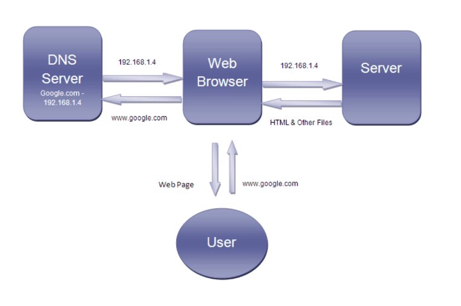
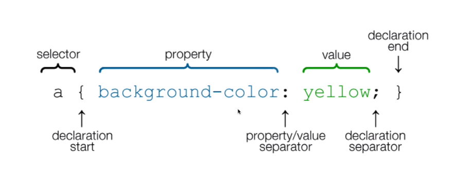
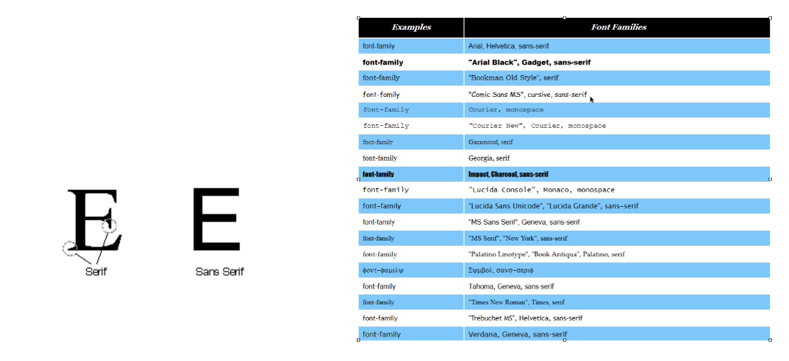
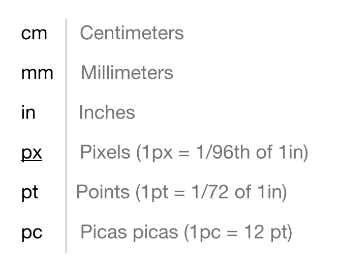
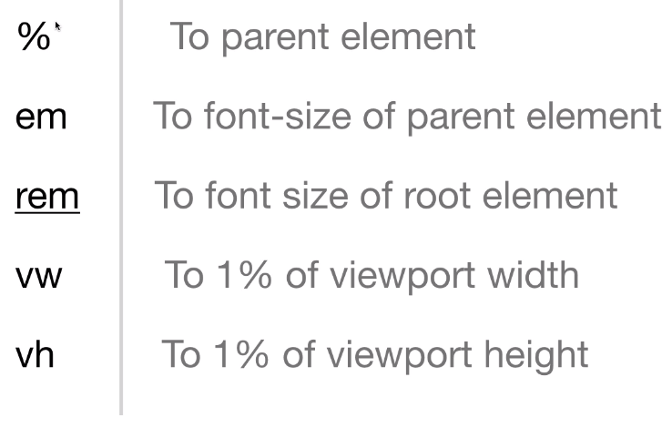
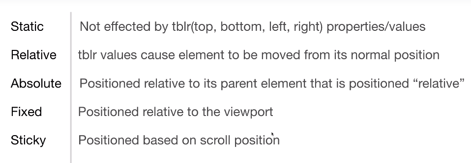
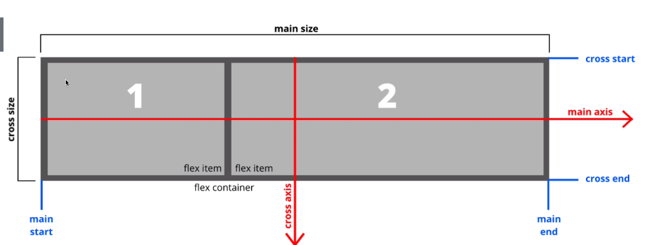

# Modern HTML & CSS From The Beginning with Brad Traversy

[Click here to find the course on udemy](https://www.udemy.com/course/modern-html-css-from-the-beginning/)

## Content

* [The Internet - how it works](#introduction)
* [About HTML](#html)
* [About CSS](#css)
* [Meta Tags](#meta-tags)
* [Typography](#typography)
* [Links and images](#links-and-images)
* [Semantic Tags](#semantic-tags)
* [CSS syntax](#css-syntax)
* [Fonts in CSS](#fonts-in-css)
* [Colors in CSS](#colors-in-css)
* [Float and Align](#float-and-align)
* [Link State & Button Styling](#link-state-&-button-styling)
* [Position](#position)
* [Viewport Height & Viewport Width Units](#viewport-height-&-viewport-width)
* [Inline Vs Inline-Block Property](#inline-vs-inline-block)
* [Flex](#flex)

## Introduction

* A global network of computers
* Each computer/router has an IP Address 161.158.0.1
  * Computer IP is private for the home network.
  * Router IP is open for the web.
* Computers talk to each other using the **TCP/IP** protocol
* **HTTP** handles web traffic (requests/responses)
* Websites/webpages are files stored on computers that run a piece of software called a web server (Apache, Nginx, etc).
* Hosting companies provide space on a server for your website
* Domain names can be purchased from registrars and linked to your hosing account/web server.
* DNS is used to map IP addresses to domain names.



## The roles of HTML and CSS

### HTML

* **Hypertext Markup Language**
* HTML is _not_ a programming langugae. You cannot make calculation and such thing.
* Markup for creating webpages / documents.
* HTML is extremely important & relevant but is also just the beginning.

### CSS

* **Cascading Style Sheet**
* Styling/Stylesheet Language
* Used for styling HTML elements
* Can be extended with Sass/Less

## Meta tags

Takes which isn't shown in the body

* meta charset
* meta viewport - make it responsive to different devices. (very important)
* meta name="description" content="This is what shows up in the description of the website, f.eks on google search."
* meta: name="keywords" content="web development, web design, etc"
* meta: name="robots" content="NOINDEX, NOFOLLOW"
  * Will make google or other search engines ignore your website.

## Typography

* h1 : tips use one h1 per page - due to search engines
* h2
* h3
* h4
* h5
* h6
* p : tips: lorem100 gives a text of 100 words.
* strong : bold --> replaced b for bold, because html is not for styling.
* em = emphasis : italic
* br : line break
* hr : line break with a horizontal rule
* del

## Links and Images

* a tag is a link and href is required.

## Semantic Tags

Not only for design, but also for usability for people with disabilities.

* header
* footer
* nav
* main
* section
* article
* aside

## CSS syntax



## Fonts in CSS



These are available for everyone by default in their browsers.

You can also use [google fonts](https://fonts.google.com/)

Pointers:

* Font-family: go for sans-serif they are cleaner see above.
* Font-size: by default 16px
* line-height: given in em, 1.6em is a good value.




## Colors in CSS

Properties:

* color: *The color of text*
* background-color: *The color of some background*
* border-color: *the color of the border of some element*

Values:

* Named colors: e.g. red or coral.
* rgb: (red, green, blue) - where each is a value between 0 to 255.
* Hexadecimal: #000000 - 0-f corresponding to red green blue - from 0-255 for each of the colors.

## Backgrounds and Borders

* .jpgs can't be transparent - use .png for transparancy
* border-width:
* border-color:
* border-style:
* border-radius: *rounds the corner (top-left top-right bottom-right bottom-left)*
* background-repeat: (repeat, repeat-x, repeat-y, round, no-repeat) *repeats the image*

## Box Model with Margin & Padding

## Float and Align

* Float was used before flex-box

## Link State & Button Styling

* a element is the proper link element
* a:hover to change properties when mouse hovers over the link
* a: visited to change the properties after the link has been visited (not much used)
* a:active when clicking it the properties may be changed (also not much used)

## Position



## Viewport Height & Viewport Width

* The height and width is always divided into 100 units.
* An element can be set to take up everything from 0 to 100 units.
* Most common to use vh (viewport height), because a lot of elements stretch out all the width anyways.

## Inline Vs Inline-Block

Compared to ```display: inline```, the ```display: inline-block``` lets you set a width and height on the element. Furthermore, the inline top and bottom margins and paddings are not respected, whereas they are with the inline-block elements.
A great advantage to getting the inline-block is that it allows us to create side-by-side boxes that collapse and wrap properly depending on available space in the parent element. Before this had to be done using floats.

## Flex



* Use ```display: flex```: which creates a flex container.
* All direct child elements are ```flex items```

Properties for the ```display:flex```

* ```justify-content:``` Align along the main axis (default horizontal).
* ```align-items:``` Align items along the cross axis (default vertical).
* ```align-content:``` Align when extra space in cross axis.
* ```flex-direction: column``` Change the main and cross axis, meaning vertical is now main and horizontal is now cross axis. (Row is default and means main axis=row, opposite for column ).

```css
/* Options for justify-content */
display: flex; /* The container element has to be a flex container */
justify-content: flex-start; /* The default, justifies to the left */
justify-content: flex-end; /* Justifies to the right */
justify-content: center; /* Justifies the child elements to the center */
justify-content: space-around; /* Divides space around each child element */
justify-content: space-between; /* All space divided inbetween the child elements */
justify-content: space-evenly; /* Distributes the space evently on the sides and inbetween */

/* Options for the align-items */
align-items: stretch; /* The default, stretches the child elements to fit the height */
align-items: flex-start; /* Justifies the child elements at the beginning of the cross-axis */
align-items: flex-end; /* Justifies the child elements at the end of the cross-axis */
align-items: center; /* Justifies the child elements at the center of the cross-axis */
align-items: baseline; /* Quite similar to flex-start, see below for Stack Overflow question about the difference */

/* Options for the align-content */
align-content: stretch; /* Stretch the space in the main axis-direction evenly. */
align-content: flex-start; /* Fills space from beginning, and leavs all space at the end of the main axis. */
align-content: flex-end; /* Same as start but at the end of the main-axis */
align-content: center; /* Sets the lines at the center. */
align-content: space-around; /* Distribute the space evenly around the lines */
align-content: space-between; /* Distribute space evenly between lines, but not at the edges */
```

* You can also target a single child element or a cluster of them and use the property ```align-self:``` to easily manage the position of the child element inside the flex container.
* The values that can be set to the *align-self* property:
  * ```auto``` (default)
  * ```stretch```
  * ```center```
  * ```flex-start```
  * ```flex-end```
  * ```baseline```
  * ```initial```
  * ```inherit```

[Link to Stack Overflow for further info on the difference between flex-start and baseline](https://stackoverflow.com/questions/34606879/whats-the-difference-between-flex-start-and-baseline)

[Back To The Top](#modern-html-&-css-from-the-beginning-with-brad-traversy)
